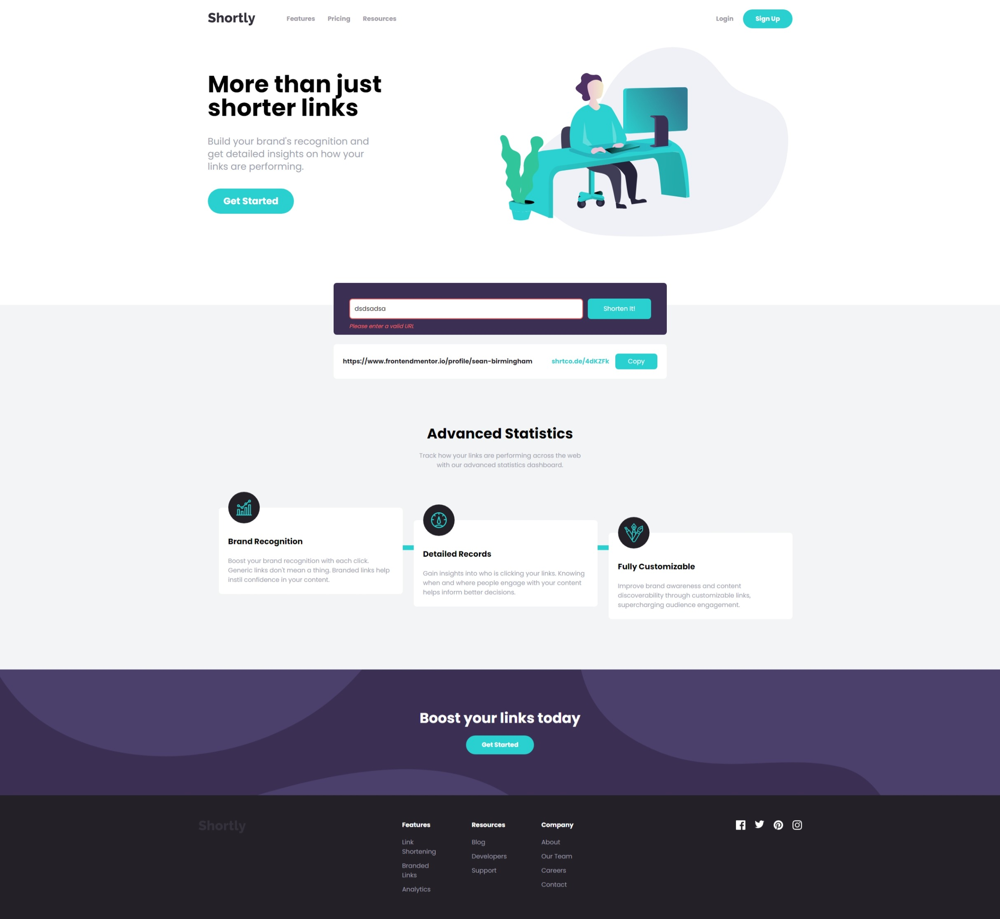

# Frontend Mentor - Shortly URL shortening API Challenge solution

This is a solution to the [Shortly URL shortening API Challenge challenge on Frontend Mentor](https://www.frontendmentor.io/challenges/url-shortening-api-landing-page-2ce3ob-G). Frontend Mentor challenges help you improve your coding skills by building realistic projects.

## Table of contents

- [Overview](#overview)
  - [The challenge](#the-challenge)
  - [Screenshot](#screenshot)
  - [Links](#links)
- [My process](#my-process)
  - [Built with](#built-with)
  - [Continued development](#continued-development)
- [Author](#author)

## Overview

### The challenge

Users should be able to:

- View the optimal layout for the site depending on their device's screen size
- Shorten any valid URL
- See a list of their shortened links, even after refreshing the browser
- Copy the shortened link to their clipboard in a single click
- Receive an error message when the `form` is submitted if:
  - The `input` field is empty
  - The `input` field contains an invalid URL that doesn't follow the correct format

### Screenshot

### Links

- Solution URL: [https://www.frontendmentor.io/solutions/responsive-url-shortener-using-tailwind-css-and-javascript-l9UkX6Tp-Y](https://www.frontendmentor.io/solutions/responsive-url-shortener-using-tailwind-css-and-javascript-l9UkX6Tp-Y)
- Live Site URL: [https://shortly-landing-page-alpha.vercel.app/](https://shortly-landing-page-alpha.vercel.app/)

## My process

### Built with

- Semantic HTML5 markup
- Tailwind CSS
- Flexbox
- Mobile-first workflow
- JavaScript

### Continued development

- I want to add a feature to see a list of their shortened links, even after refreshing the browser.

## Author

- Frontend Mentor - [@sean-birmingham](https://www.frontendmentor.io/profile/sean-birmingham)
- Twitter - [@THEHYDRA98](https://www.twitter.com/thehydra98)
